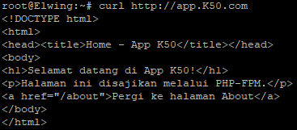
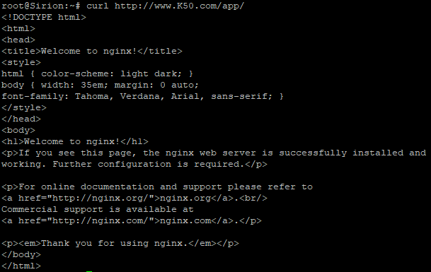
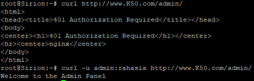
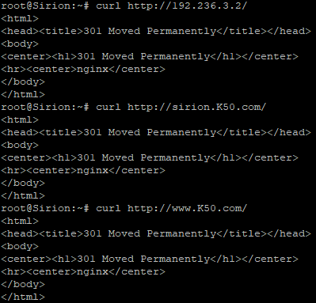
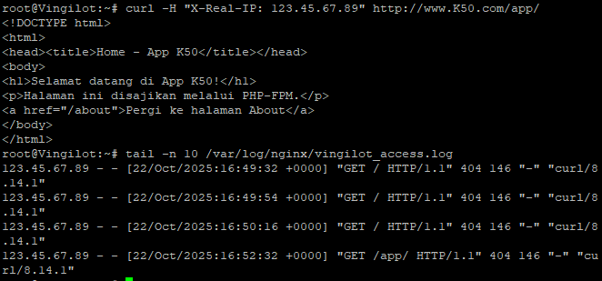
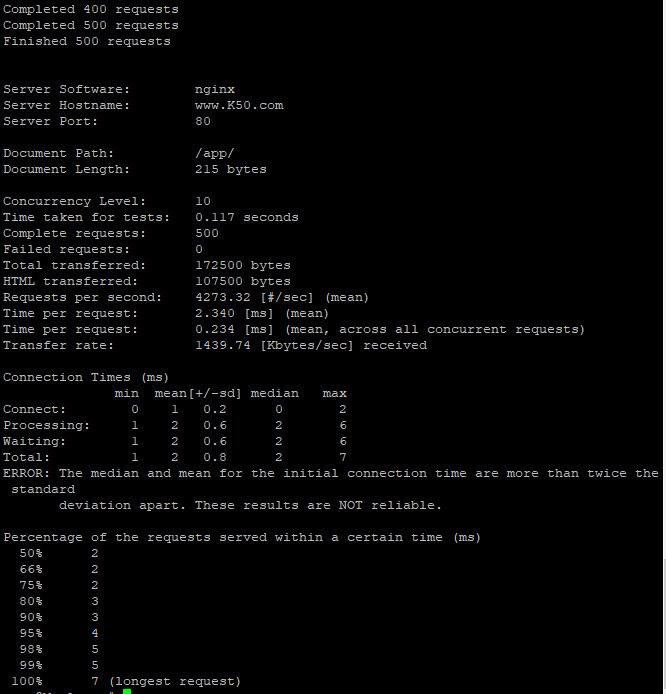
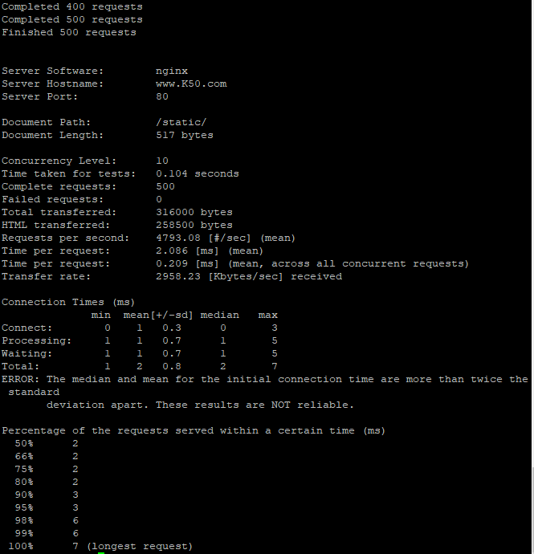

# Jarkom-Modul-2-2025-K50

| Nama                    | NRP        |
| ----------------------- | ---------- |
| Rayka Dharma Pranandita | 5027241039 |
| Yasykur Khalis J M Y    | 5027241112 |

# Prefix IP

| Kelompok | Prefix IP |
| -------- | --------- |
| K-50     | 192.236   |

## Soal 1

Buat Topologi dan tetapkan alamat dan default gateway tiap tokoh sesuai glosarium yang sudah diberikan:  


Network Config:

- **Eonwe**:
```
# WAN Interface
auto eth0
iface eth0 inet dhcp

# LAN Interface ke Jalur Barat
auto eth1
iface eth1 inet static
address 192.236.1.1
netmask 255.255.255.0

# LAN Interface ke Jalur Timur
auto eth2
iface eth2 inet static
address 192.236.2.1
netmask 255.255.255.0

# LAN Interface ke Pelabuhan DMZ
auto eth3
iface eth3 inet static
address 192.236.3.1
netmask 255.255.255.0

# Otomatis menjalankan iptables untuk connect ke internet luar
up iptables -t nat -A POSTROUTING -o eth0 -j    MASQUERADE -s 192.236.0.0/16 

```

- **Barat**:    
Kurang lebih menggunakan format berikut, dengan adjustment angka akhir adress untuk tiap node/client
```
auto eth0
iface eth0 inet static
	address 192.236.1.2
	netmask 255.255.255.0
	gateway 192.236.1.1

    # autorun untuk bisa connect ke internet luar
	up echo nameserver 192.168.122.1 > /etc/resolv.conf
```
- **Timur**:    
Kurang lebih menggunakan format berikut, dengan adjustment angka akhir adress untuk tiap node/client
```
auto eth0
iface eth0 inet static
	address 192.236.2.2
	netmask 255.255.255.0
	gateway 192.236.2.1
	
    # autorun untuk bisa connect ke internet luar
    up echo nameserver 192.168.122.1 > /etc/resolv.conf
```
- **Pelabuhan DMZ**:    
Kurang lebih menggunakan format berikut, dengan adjustment angka akhir adress untuk tiap node/client
```
auto eth0
iface eth0 inet static
	address 192.236.3.3
	netmask 255.255.255.0
	gateway 192.236.3.1
	
    # autorun untuk bisa connect ke internet luar
    up echo nameserver 192.168.122.1 > /etc/resolv.conf
```

## Soal 2
Memastikan jalur WAN di router aktif dan NAT meneruskan trafik keluar sehingga host di dalam dapat mencapai layanan di luar menggunakan IP address.

Hal ini dilakukan dengan menambahkan network config:
- **Router (Eonwe)**
```@router
up iptables -t nat -A POSTROUTING -o eth0 -j    MASQUERADE -s 192.236.0.0/16
```
- **Client/Host/Nodes**
```@client
up echo nameserver 192.168.122.1 > /etc/resolv.conf
```

Proof:    
<br>


## Soal 3
Kabar dari Barat menyapa Timur. Pastikan kelima klien dapat saling berkomunikasi lintas jalur (routing internal via Eonwe berfungsi), lalu pastikan setiap host non-router menambahkan resolver 192.168.122.1 saat interfacenya aktif agar akses paket dari internet tersedia sejak awal.

Seperti yang dibahas tadi, kami sudah menambahkan echo nameserver  saat interfacenya aktif, selanjutnya untuk memastikan koneksi antar client bisa terjadi kami menambahkan config ip forwarding di Router (Eonwe):
<br>

<br>
Setelah itu run config:    
<br>
    

Proof:
- Koneksi Barat ke Timur:
  <br>
  
- Koneksi Timur ke Barat:
  <br>
  

## Soal 4

Di Tirion:

Instalasi BIND9

```
apt update
apt install bind9 -y
```

Edit file konfigurasi utama zona:

di `/etc/bind/named.conf.local`:

```
zone "K50.com" {
    type master;
    file "/etc/bind/zones/db.K50.com";
    allow-transfer { 192.236.3.4; };   // hanya Valmar boleh ambil zona
    notify yes;                        // otomatis beri tahu Valmar kalau zona berubah
};
```

Tambahkan forwarders ke internet:

`/etc/bind/named.conf.options`:

```
options {
    directory "/var/cache/bind";

    forwarders {
        192.168.122.1;   // forward ke DNS eksternal
    };

    allow-query { any; };
    recursion yes;

    dnssec-validation no;

    listen-on { any; };
};
```
Buat folder zona dan file `db.K50.com` di folder tersebut:

```
$TTL    604800
@       IN      SOA     ns1.K50.com. root.K50.com. (
                        2025101101      ; Serial (ubah tiap kali edit)
                        604800          ; Refresh
                        86400           ; Retry
                        2419200         ; Expire
                        604800 )        ; Negative Cache TTL
;
@       IN      NS      ns1.K50.com.
@       IN      NS      ns2.K50.com.

ns1     IN      A       192.236.3.3
ns2     IN      A       192.236.3.4
@       IN      A       192.236.3.2
```

Restart dan cek syntax:
```
named-checkconf
named-checkzone <xxxx>.com /etc/bind/zones/db.<xxxx>.com
named -g -c /etc/bind/named.conf &
```

Lakukan juga untuk Valmar. Lalu edit `/etc/resolv.conf` di salah satu client (misal Elrond):

```
nameserver 192.236.3.3
nameserver 192.236.3.4
nameserver 192.168.122.1
```

Verifikasi di salah satu client:

```
dig @192.236.3.3 ns1.K50.com
dig @192.236.3.4 ns2.K50.com
```
<br>

.    
<br>
## Soal 5
Namai semua tokoh (hostname) sesuai glosarium, eonwe, earendil, elwing, cirdan, elrond, maglor, sirion, tirion, valmar, lindon, vingilot, dan verifikasi bahwa setiap host mengenali dan menggunakan hostname tersebut secara system-wide. Buat setiap domain untuk masing masing node sesuai dengan namanya (contoh: eru.<xxxx>.com) dan assign IP masing-masing juga. Lakukan pengecualian untuk node yang bertanggung jawab atas ns1 dan ns2

Sebelumnya pastikan untuk tiap client sudah memiliki hostname, bisa dicek dengan menggunakan ``hostname``, jika belum tambahkan dengan melakukan ``nano /etc/hosts`` dan tambahkan line:

```/etc/hosts @Cirdan
127.0.1.1       Cirdan
127.0.0.1       localhost
```


Selanjutnya kita mendaftarkan Alamat di **DNS Tirion** (A Records), pertama lakukan ``nano /etc/bind/zones/db.K50.com``, naikkan angka serial dan tambahkan ini:
```
; hostname record
eonwe       IN      A       192.236.1.1    ; IP eth1 Eonwe
earendil    IN      A       192.236.1.2
elwing      IN      A       192.236.1.3
cirdan      IN      A       192.236.2.2
elrond      IN      A       192.236.2.3
maglor      IN      A       192.236.2.4
sirion      IN      A       192.236.3.2
tirion      IN      A       192.236.3.3
valmar      IN      A       192.236.3.4
lindon      IN      A       192.236.3.5
vingilot    IN      A       192.236.3.6
```


Jangan lupa save dan setelah itu reload server dengan ``rndc reload``
Selanjutnya kita test beberapa domain:
- **vingilot.k50.com**
  <br>
  
  <br>
  Terlihat IP Address yang sesuai dengan config kita tadi
- **elwing.k50.com**
  <br>
  
  <br>
  Terlihat IP Address yang sesuai dengan config kita tadi
- **maglor.k50.com**
  <br>
  
  <br>
  Terlihat IP Address yang sesuai dengan config kita tadi

## Soal 6
Lonceng Valmar berdentang mengikuti irama Tirion. Pastikan zone transfer berjalan, Pastikan Valmar (ns2) telah menerima salinan zona terbaru dari Tirion (ns1). Nilai serial SOA di keduanya harus sama

Kita lakukan pengecekan apakah nilai serial yang baru di Tirion sama dengan Valmar, kita coba cek dengan:
- Cek Tirion
  <br>
  
- Cek Valmar
  <br>
  

## Soal 7
Tambahkan pada zona <xxxx>.com A record untuk sirion.<xxxx>.com (IP Sirion), lindon.<xxxx>.com (IP Lindon), dan vingilot.<xxxx>.com (IP Vingilot). Tetapkan CNAME :
www.<xxxx>.com → sirion.<xxxx>.com, 
static.<xxxx>.com → lindon.<xxxx>.com, dan 
app.<xxxx>.com → vingilot.<xxxx>.com. 
Verifikasi dari dua klien berbeda bahwa seluruh hostname tersebut ter-resolve ke tujuan yang benar dan konsisten.

Untuk menambahkan cname kita bisa tambahkan di ns1 (**Tirion**) dan membuka ``nano /etc/bind/zones/db.K50.com`` lalu menambahkan:
```/etc/bind/zones/db.K50.com
; Service Aliases (CNAME Records for public-facing names)
www         IN      CNAME   sirion.K50.com.
static      IN      CNAME   lindon.K50.com.
app         IN      CNAME   vingilot.K50.com.
```
Jangan lupa save dan setelah itu reload server dengan ``rndc reload``. Setelah itu kita coba test dengan client **Cirdan** dan **Vingilot**:
- **Cirdan**:
  <br>
  
  <br>
  
  <br>
  
  
- **Vingilot**:
  <br>
  
  <br>
  
  <br>
  
<br>

## Soal 8
Pertama siapkan script sh untuk **Tirion** dan **Valmar**:
- **Tirion**:
```
#!/bin/bash

# --- Configs ---
DOMAIN="K50.com"
REVERSE_ZONE="3.236.192.in-addr.arpa"
REVERSE_ZONE_FILE="/etc/bind/zones/db.192.236.3"
SLAVE_IP="192.236.3.4"

# Deklarasi zone di named.conf.local
tee -a /etc/bind/named.conf.local > /dev/null <<EOF

zone "$REVERSE_ZONE" {
    type master;
    file "$REVERSE_ZONE_FILE";
    allow-transfer { $SLAVE_IP; };
};
EOF

# Buat file reverse zone
tee $REVERSE_ZONE_FILE > /dev/null <<EOF
\$TTL    604800
@       IN      SOA     ns1.$DOMAIN. root.$DOMAIN. (
                        $(date +%Y%m%d)01      ; Serial
                        604800          ; Refresh
                        86400           ; Retry
                        2419200         ; Expire
                        604800 )        ; Negative Cache TTL
;
@       IN      NS      ns1.$DOMAIN.
@       IN      NS      ns2.$DOMAIN.

; PTR Records
2       IN      PTR     sirion.$DOMAIN.
5       IN      PTR     lindon.$DOMAIN.
6       IN      PTR     vingilot.$DOMAIN.
EOF

# Validasi & reload
named-checkconf
named-checkzone $REVERSE_ZONE $REVERSE_ZONE_FILE
rndc reload

echo "Setup reverse master di Tirion selesai."  
```
- **Valmar**:
```
#!/bin/bash

# --- Configs ---
REVERSE_ZONE="3.236.192.in-addr.arpa"
MASTER_IP="192.236.3.3"

# Deklarasi slave zone di named.conf.local
tee -a /etc/bind/named.conf.local > /dev/null <<EOF

zone "$REVERSE_ZONE" {
    type slave;
    file "/var/lib/bind/db.192.236.3";
    masters { $MASTER_IP; };
};
EOF

# Reload
rndc reload

echo "Setup reverse slave di Valmar selesai. Cek syslog buat liat transfer log."
```

Setelah selesai setup reverse proxy, kita lanjutkan uji coba keberhasilan query reverse untuk alamat Sirion, Lindon, Vingilot:
- **Sirion**:
  <br>
  
- **Lindon**:
  <br>
  
- **Vingilot**:
  <br>
  

# Soal 9:
static.<xxxx>.com dan buka folder arsip /annals/ dengan autoindex (directory listing) sehingga isinya dapat ditelusuri. Akses harus dilakukan melalui hostname, bukan IP.

Dari situ, dibuat script sh:
```
#!/bin/bash

# 1. Install Nginx
apt-get update
apt-get install -y nginx

# 2. Buat folder dan file arsip
mkdir -p "/var/www/html/annals"
touch "/var/www/html/annals/halo.txt"
touch "/var/www/html/annals/dunia.txt"
touch "/var/www/html/annals/K50.md"

# 3. Buat file konfigurasi Nginx
tee /etc/nginx/sites-available/static > /dev/null <<'EOF'
server {
    listen 80;
    listen [::]:80;

    server_name static.K50.com;
    root /var/www/html;
    index index.html;

    location /annals/ {
        autoindex on;
    }

    location / {
        try_files $uri $uri/ =404;
    }
}
EOF

# 4. Aktifkan site & nonaktifkan default
ln -s /etc/nginx/sites-available/static /etc/nginx/sites-enabled/
rm -f /etc/nginx/sites-enabled/default

# 5. Tes dan reload Nginx
nginx -t
service nginx reload
```

Setelah itu lakukan pengecekan dengan melakukan curl ke http://static.K50.com:

## Soal 10

Script di Vingilot:
```bash
#!/bin/bash
# Soal 10 - Web Dinamis (PHP-FPM + Nginx) untuk Debian 13 (Trixie fix pakai bookworm repo)

set -e

echo "[+] Update repo & install dependensi dasar..."
apt update -y
apt install -y lsb-release ca-certificates curl gnupg2 apt-transport-https

echo "[+] Tambahkan repository PHP (pakai bookworm karena trixie belum didukung)..."
mkdir -p /usr/share/keyrings
curl -fsSL https://packages.sury.org/php/apt.gpg | gpg --dearmor -o /usr/share/keyrings/sury.gpg
echo "deb [signed-by=/usr/share/keyrings/sury.gpg] https://packages.sury.org/php/ bookworm main" > /etc/apt/sources.list.d/php.list

apt update -y

echo "[+] Instal Nginx dan PHP-FPM..."
apt install -y nginx php8.2-fpm php8.2-cli

echo "[+] Jalankan PHP-FPM..."
mkdir -p /run/php
php-fpm8.2 -D
sleep 2

PHP_SOCK=$(find /run/php -name "php*-fpm.sock" | head -n 1)
echo "    Socket PHP-FPM: $PHP_SOCK"

echo "[+] Siapkan direktori web..."
mkdir -p /var/www/app.K50.com

cat > /var/www/app.K50.com/index.php <<'EOF'
<!DOCTYPE html>
<html>
<head><title>Home - App K50</title></head>
<body>
<h1>Selamat datang di App K50!</h1>
<p>Halaman ini disajikan melalui PHP-FPM.</p>
<a href="/about">Pergi ke halaman About</a>
</body>
</html>
EOF

cat > /var/www/app.K50.com/about.php <<'EOF'
<!DOCTYPE html>
<html>
<head><title>About - App K50</title></head>
<body>
<h1>About</h1>
<p>Halaman ini tampil tanpa ekstensi .php (rewrite Nginx).</p>
<a href="/">Kembali ke Home</a>
</body>
</html>
EOF

echo "[+] Konfigurasi Nginx untuk app.K50.com..."
mkdir -p /etc/nginx/sites-available /etc/nginx/sites-enabled

cat > /etc/nginx/sites-available/app.K50.com <<EOF
server {
    listen 80;
    server_name app.K50.com;

    root /var/www/app.K50.com;
    index index.php;

    location / {
        try_files \$uri \$uri/ /index.php?\$query_string;
    }

    location /about {
        rewrite ^/about\$ /about.php last;
    }

    location ~ \.php\$ {
        include snippets/fastcgi-php.conf;
        fastcgi_pass unix:$PHP_SOCK;
    }

    location ~ /\.ht {
        deny all;
    }
}
EOF

ln -sf /etc/nginx/sites-available/app.K50.com /etc/nginx/sites-enabled/app.K50.com

echo "[+] Jalankan Nginx (tanpa systemctl)..."
nginx -g 'daemon off;' &
sleep 3

echo "[+] Tambahkan host lokal ke /etc/hosts..."
grep -q "app.K50.com" /etc/hosts || echo "127.0.0.1 app.K50.com" >> /etc/hosts

echo "[+] Tes akses ke web..."
curl -s http://app.K50.com/ | head -n 5

echo "[✓] Web dinamis app.K50.com aktif!"
```

Uji coba:



## Soal 11

Script di Sirion:
```bash
#!/bin/bash

# Soal 11 - Reverse Proxy Sirion

set -e

ZONE="K50.com"
NGINX_CONF_DIR="/etc/nginx"
SITES_AVAILABLE="$NGINX_CONF_DIR/sites-available"
SITES_ENABLED="$NGINX_CONF_DIR/sites-enabled"

echo "[0/6] Menambahkan record /etc/hosts..."
grep -q "sirion.$ZONE" /etc/hosts || echo "192.236.3.2   sirion.$ZONE [www.$ZONE](http://www.$ZONE)" >> /etc/hosts
grep -q "lindon.$ZONE" /etc/hosts || echo "192.236.3.5   lindon.$ZONE" >> /etc/hosts
grep -q "vingilot.$ZONE" /etc/hosts || echo "192.236.3.6   vingilot.$ZONE" >> /etc/hosts

echo "[1/6] Instal nginx..."
apt-get update -y
apt-get install -y nginx

echo "[2/6] Membuat konfigurasi reverse proxy..."
mkdir -p "$SITES_AVAILABLE" "$SITES_ENABLED"

tee "$SITES_AVAILABLE/sirion.$ZONE" > /dev/null <<'EOF'
server {
listen 80;
server_name www.K50.com sirion.K50.com;

# Proxy ke Lindon untuk /static → arahkan ke /annals/ di backend
location /static/ {
    proxy_pass http://lindon.K50.com/annals/;
    proxy_set_header Host $host;
    proxy_set_header X-Real-IP $remote_addr;
}

# Proxy ke Vingilot untuk /app → arahkan ke root backend
location /app/ {
    proxy_pass http://vingilot.K50.com/;
    proxy_set_header Host $host;
    proxy_set_header X-Real-IP $remote_addr;
}

# Default: redirect ke /app
location / {
    return 301 /app/;
}

access_log /var/log/nginx/sirion_access.log;
error_log /var/log/nginx/sirion_error.log;

}
EOF

echo "[3/6] Aktifkan konfigurasi..."
ln -sf "$SITES_AVAILABLE/sirion.$ZONE" "$SITES_ENABLED/sirion.$ZONE"
rm -f "$SITES_ENABLED/default"

echo "[4/6] Uji konfigurasi..."
nginx -t

echo "[5/6] Jalankan nginx..."
rm -f /var/run/nginx.pid
nginx -s stop 2>/dev/null || true
nginx

echo "✅ Sirion siap sebagai reverse proxy:"
echo "   [http://www.K50.com/static/](http://www.K50.com/static/) → Lindon (annals)"
echo "   [http://www.K50.com/app/](http://www.K50.com/app/)    → Vingilot"
echo "   Header Host & X-Real-IP diteruskan."
```

Uji coba:



## Soal 12

Script di Sirion:
```bash
#!/bin/bash
# Soal 12: Sirion Reverse Proxy + Basic Auth

set -e

ZONE="K50.com"
NGINX_CONF="/etc/nginx/sites-available/sirion.$ZONE"
HTPASSWD_FILE="/etc/nginx/.htpasswd"

echo "[0/8] Tambahkan record /etc/hosts..."
grep -q "sirion.$ZONE" /etc/hosts || echo "192.236.3.2   sirion.$ZONE www.$ZONE" >> /etc/hosts
grep -q "lindon.$ZONE" /etc/hosts || echo "192.236.3.5   lindon.$ZONE" >> /etc/hosts
grep -q "vingilot.$ZONE" /etc/hosts || echo "192.236.3.6   vingilot.$ZONE" >> /etc/hosts

echo "[1/8] Install Nginx dan apache2-utils..."
apt-get update -y
apt-get install -y nginx apache2-utils

echo "[2/8] Buat direktori admin dan index.html..."
mkdir -p /var/www/admin
echo "Welcome to the Admin Panel" > /var/www/admin/index.html
chown -R www-data:www-data /var/www/admin
chmod 755 /var/www/admin
chmod 644 /var/www/admin/index.html

echo "[3/8] Buat htpasswd untuk /admin..."
# user: admin, pass: rahasia
htpasswd -bc $HTPASSWD_FILE admin rahasia

echo "[4/8] Buat konfigurasi Nginx Sirion..."
mkdir -p /etc/nginx/sites-available /etc/nginx/sites-enabled
cat > $NGINX_CONF <<EOF
server {
    listen 80;
    server_name www.$ZONE sirion.$ZONE;

    # Redirect /admin tanpa trailing slash
    location = /admin {
        return 301 /admin/;
    }

    # Default redirect ke /app/
    location = / {
        return 301 /app/;
    }

    # Proxy ke Lindon untuk /static/
    location /static/ {
        proxy_pass http://lindon.$ZONE/annals/;
        proxy_set_header Host \$host;
        proxy_set_header X-Real-IP \$remote_addr;
    }

    # Proxy ke Vingilot untuk /app/
    location /app/ {
        proxy_pass http://vingilot.$ZONE/;
        proxy_set_header Host \$host;
        proxy_set_header X-Real-IP \$remote_addr;
    }

    # Basic Auth untuk /admin/
    location /admin/ {
        auth_basic "Restricted Area";
        auth_basic_user_file $HTPASSWD_FILE;
        alias /var/www/admin/;
        index index.html;
    }

    access_log /var/log/nginx/sirion_access.log;
    error_log  /var/log/nginx/sirion_error.log;
}
EOF

echo "[5/8] Aktifkan konfigurasi..."
ln -sf $NGINX_CONF /etc/nginx/sites-enabled/sirion.$ZONE
rm -f /etc/nginx/sites-enabled/default

echo "[6/8] Tes konfigurasi..."
nginx -t

echo "[7/8] Jalankan Nginx..."
rm -f /run/nginx.pid
nginx

echo "[8/8] Selesai ✅"
echo "Coba akses:"
echo "  http://www.$ZONE/static/ → Lindon"
echo "  http://www.$ZONE/app/    → Vingilot"
echo "  http://www.$ZONE/admin/  → Basic Auth (user: admin, pass: rahasia)"
```

Uji coba tanpa dan dengan authorisasi:



## Soal 13
```bash
#!/bin/bash
# Soal 13: Sirion Reverse Proxy + Canonical Host Redirect

set -e

ZONE="K50.com"
NGINX_CONF="/etc/nginx/sites-available/sirion.$ZONE"
HTPASSWD_FILE="/etc/nginx/.htpasswd"

echo "[0/6] Tambahkan record /etc/hosts..."
grep -q "sirion.$ZONE" /etc/hosts || echo "192.236.3.2   sirion.$ZONE" >> /etc/hosts
grep -q "lindon.$ZONE" /etc/hosts || echo "192.236.3.5   lindon.$ZONE" >> /etc/hosts
grep -q "vingilot.$ZONE" /etc/hosts || echo "192.236.3.6   vingilot.$ZONE" >> /etc/hosts

echo "[1/6] Install Nginx & apache2-utils..."
apt-get update -y
apt-get install -y nginx apache2-utils

echo "[2/6] Buat htpasswd untuk /admin (user: admin, pass: rahasia)..."
htpasswd -bc $HTPASSWD_FILE admin rahasia

echo "[3/6] Buat konfigurasi Nginx Sirion..."
cat > $NGINX_CONF <<EOF
# Server block untuk canonical redirect
server {
    listen 80;
    server_name 192.236.3.2 sirion.$ZONE;

    # Redirect semua ke hostname kanonik
    return 301 http://www.$ZONE\$request_uri;
}

# Server block utama untuk www.K50.com
server {
    listen 80;
    server_name www.$ZONE;

    # Default redirect ke /app/ jika root diakses
    location = / {
        return 301 /app/;
    }

    # Proxy ke Lindon untuk /static/
    location /static/ {
        proxy_pass http://lindon.$ZONE/annals/;
        proxy_set_header Host \$host;
        proxy_set_header X-Real-IP \$remote_addr;
    }

    # Proxy ke Vingilot untuk /app/
    location /app/ {
        proxy_pass http://vingilot.$ZONE/;
        proxy_set_header Host \$host;
        proxy_set_header X-Real-IP \$remote_addr;
    }

    # Basic Auth untuk /admin/
    location /admin/ {
        auth_basic "Restricted Area";
        auth_basic_user_file $HTPASSWD_FILE;
        alias /var/www/admin/;
        index index.html;
    }

    access_log /var/log/nginx/sirion_access.log;
    error_log  /var/log/nginx/sirion_error.log;
}
EOF

echo "[4/6] Aktifkan konfigurasi..."
mkdir -p /etc/nginx/sites-enabled
ln -sf $NGINX_CONF /etc/nginx/sites-enabled/sirion.$ZONE
rm -f /etc/nginx/sites-enabled/default

echo "[5/6] Tes konfigurasi..."
nginx -t

echo "[6/6] Jalankan Nginx..."
rm -f /run/nginx.pid
nginx

echo "✅ Sirion siap dengan canonical redirect!"
echo "Coba akses:"
echo "  http://192.236.3.2/      → redirect ke http://www.$ZONE/"
echo "  http://sirion.$ZONE/     → redirect ke http://www.$ZONE/"
echo "  http://www.$ZONE/static/ → Lindon"
echo "  http://www.$ZONE/app/    → Vingilot"
echo "  http://www.$ZONE/admin/  → Basic Auth (user: admin, pass: rahasia)"
```

Uji coba(me-return 301 untuk me-redirect):



## Soal 14
```bash
#!/bin/bash
# Soal 14 - Vingilot: log client IP asli lewat Sirion (fixed)

set -e

ZONE="K50.com"
NGINX_CONF="/etc/nginx/sites-available/vingilot.$ZONE"

echo "[0/5] Pastikan direktori root dan log ada..."
mkdir -p /var/www/vingilot
touch /var/log/nginx/vingilot_access.log /var/log/nginx/vingilot_error.log

echo "[1/5] Install Nginx dan PHP-FPM jika belum ada..."
apt-get update -y
apt-get install -y nginx php-fpm

echo "[2/5] Tambahkan log_format di http context (jika belum ada)..."
if ! grep -q "log_format custom" /etc/nginx/nginx.conf; then
    sed -i '/http {/a \
    \    log_format custom '\''$http_x_real_ip - $remote_user [$time_local] "$request" $status $body_bytes_sent "$http_referer" "$http_user_agent"'\'';' /etc/nginx/nginx.conf
fi

echo "[3/5] Buat konfigurasi Nginx Vingilot..."
cat > $NGINX_CONF <<EOF
server {
    listen 80;
    server_name vingilot.$ZONE;

    root /var/www/vingilot;
    index index.php index.html;

    access_log /var/log/nginx/vingilot_access.log custom;
    error_log  /var/log/nginx/vingilot_error.log;

    location / {
        try_files \$uri /index.php?\$query_string;
    }

    location ~ \.php\$ {
        include snippets/fastcgi-php.conf;
        fastcgi_pass unix:/run/php/php-fpm.sock;
        fastcgi_param REMOTE_ADDR \$http_x_real_ip;  # Pastikan PHP melihat IP asli
    }
}
EOF

echo "[4/5] Aktifkan konfigurasi..."
mkdir -p /etc/nginx/sites-enabled
ln -sf $NGINX_CONF /etc/nginx/sites-enabled/vingilot.$ZONE
rm -f /etc/nginx/sites-enabled/default

echo "[5/5] Tes dan reload Nginx..."
nginx -t
systemctl reload nginx || nginx -s reload

echo "✅ Vingilot siap, access log sekarang mencatat IP asli klien."
echo "Cek log: /var/log/nginx/vingilot_access.log"
```

Uji coba:



## Soal 15

Masuk ke salah satu client dan install ApacheBench:
```
apt-get update -y && apt-get install -y apache2-utils
```

Jalankan untuk web dinamis:
```
ab -n 500 -c 10 http://www.K50.com/app/
```



dan web statis:
```
ab -n 500 -c 10 http://www.K50.com/static/
```


