# Jarkom-Modul-2-2025-K50

| Nama                    | NRP        |
| ----------------------- | ---------- |
| Rayka Dharma Pranandita | 5027241039 |
| Yasykur Khalis J M Y    | 5027241112 |

# Prefix IP

| Kelompok | Prefix IP |
| -------- | --------- |
| K-50     | 192.236   |

## Soal 1

Buat Topologi dan tetapkan alamat dan default gateway tiap tokoh sesuai glosarium yang sudah diberikan:  
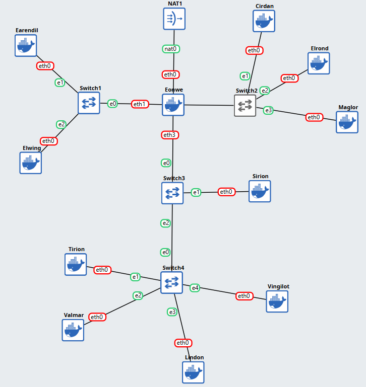

Network Config:

- **Eonwe**:
```
# WAN Interface
auto eth0
iface eth0 inet dhcp

# LAN Interface ke Jalur Barat
auto eth1
iface eth1 inet static
address 192.236.1.1
netmask 255.255.255.0

# LAN Interface ke Jalur Timur
auto eth2
iface eth2 inet static
address 192.236.2.1
netmask 255.255.255.0

# LAN Interface ke Pelabuhan DMZ
auto eth3
iface eth3 inet static
address 192.236.3.1
netmask 255.255.255.0

# Otomatis menjalankan iptables untuk connect ke internet luar
up iptables -t nat -A POSTROUTING -o eth0 -j    MASQUERADE -s 192.236.0.0/16 

```

- **Barat**:    
Kurang lebih menggunakan format berikut, dengan adjustment angka akhir adress untuk tiap node/client
```
auto eth0
iface eth0 inet static
	address 192.236.1.2
	netmask 255.255.255.0
	gateway 192.236.1.1

    # autorun untuk bisa connect ke internet luar
	up echo nameserver 192.168.122.1 > /etc/resolv.conf
```
- **Timur**:    
Kurang lebih menggunakan format berikut, dengan adjustment angka akhir adress untuk tiap node/client
```
auto eth0
iface eth0 inet static
	address 192.236.2.2
	netmask 255.255.255.0
	gateway 192.236.2.1
	
    # autorun untuk bisa connect ke internet luar
    up echo nameserver 192.168.122.1 > /etc/resolv.conf
```
- **Pelabuhan DMZ**:    
Kurang lebih menggunakan format berikut, dengan adjustment angka akhir adress untuk tiap node/client
```
auto eth0
iface eth0 inet static
	address 192.236.3.3
	netmask 255.255.255.0
	gateway 192.236.3.1
	
    # autorun untuk bisa connect ke internet luar
    up echo nameserver 192.168.122.1 > /etc/resolv.conf
```

## Soal 2
Memastikan jalur WAN di router aktif dan NAT meneruskan trafik keluar sehingga host di dalam dapat mencapai layanan di luar menggunakan IP address.

Hal ini dilakukan dengan menambahkan network config:
- **Router (Eonwe)**
```@router
up iptables -t nat -A POSTROUTING -o eth0 -j    MASQUERADE -s 192.236.0.0/16
```
- **Client/Host/Nodes**
```@client
up echo nameserver 192.168.122.1 > /etc/resolv.conf
```

Proof:
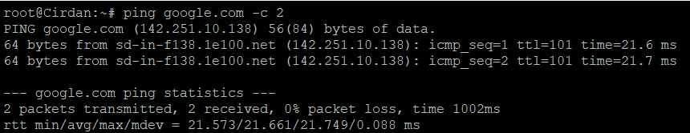

## Soal 3
Kabar dari Barat menyapa Timur. Pastikan kelima klien dapat saling berkomunikasi lintas jalur (routing internal via Eonwe berfungsi), lalu pastikan setiap host non-router menambahkan resolver 192.168.122.1 saat interfacenya aktif agar akses paket dari internet tersedia sejak awal.

Seperti yang dibahas tadi, kami sudah menambahkan echo nameserver  saat interfacenya aktif, selanjutnya untuk memastikan koneksi antar client bisa terjadi kami menambahkan config ip forwarding di Router (Eonwe):
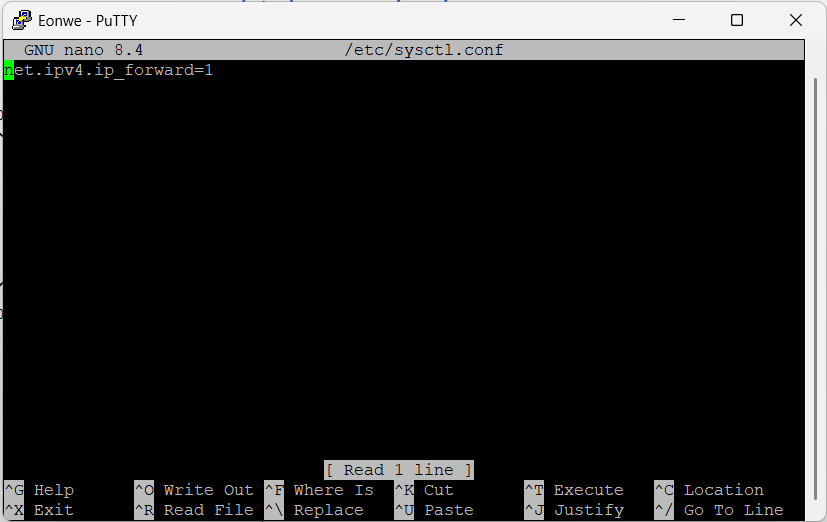
Setelah itu run config:    
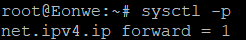    

Proof:
- Koneksi Barat ke Timur:
  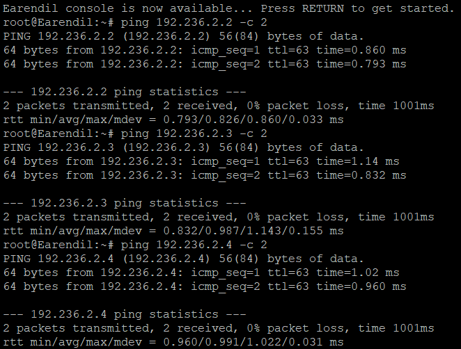
- Koneksi Timur ke Barat:
  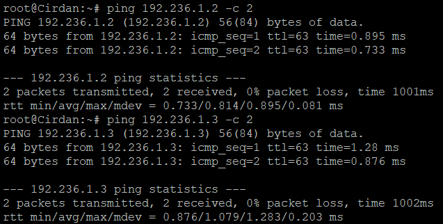

## Soal 4

Di Tirion:

Instalasi BIND9

```
sudo apt update
sudo apt install bind9 -y
```

Edit file konfigurasi utama zona:

di `/etc/bind/named.conf.local`:

```
zone "K50.com" {
    type master;
    file "/etc/bind/zones/db.K50.com";
    allow-transfer { 192.236.3.4; };   // hanya Valmar boleh ambil zona
    notify yes;                        // otomatis beri tahu Valmar kalau zona berubah
};
```

Tambahkan forwarders ke internet:

`/etc/bind/named.conf.options`:

```
options {
    directory "/var/cache/bind";

    forwarders {
        192.168.122.1;   // forward ke DNS eksternal
    };

    allow-query { any; };
    recursion yes;

    dnssec-validation no;

    listen-on { any; };
};
```
Buat folder zona dan file `db.K50.com` di folder tersebut:

```
$TTL    604800
@       IN      SOA     ns1.K50.com. root.K50.com. (
                        2025101101      ; Serial (ubah tiap kali edit)
                        604800          ; Refresh
                        86400           ; Retry
                        2419200         ; Expire
                        604800 )        ; Negative Cache TTL
;
@       IN      NS      ns1.K50.com.
@       IN      NS      ns2.K50.com.

ns1     IN      A       192.236.3.3
ns2     IN      A       192.236.3.4
@       IN      A       192.236.3.2
```

Restart dan cek syntax:
```
named-checkconf
named-checkzone <xxxx>.com /etc/bind/zones/db.<xxxx>.com
named -g -c /etc/bind/named.conf &
```

Lakukan juga untuk Valmar. Lalu edit `/etc/resolv.conf` di salah satu client (misal Elrond):

```
nameserver 192.236.3.3
nameserver 192.236.3.4
nameserver 192.168.122.1
```

Verifikasi di salah satu client:

```
dig @192.236.3.3 ns1.K50.com
dig @192.236.3.4 ns2.K50.com
```

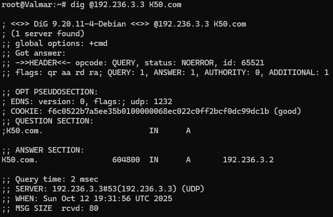    

## Soal 5
Namai semua tokoh (hostname) sesuai glosarium, eonwe, earendil, elwing, cirdan, elrond, maglor, sirion, tirion, valmar, lindon, vingilot, dan verifikasi bahwa setiap host mengenali dan menggunakan hostname tersebut secara system-wide. Buat setiap domain untuk masing masing node sesuai dengan namanya (contoh: eru.<xxxx>.com) dan assign IP masing-masing juga. Lakukan pengecualian untuk node yang bertanggung jawab atas ns1 dan ns2

Sebelumnya pastikan untuk tiap client sudah memiliki hostname, bisa dicek dengan menggunakan ``hostname``, jika belum tambahkan dengan melakukan ``nano /etc/hosts`` dan tambahkan line:

```/etc/hosts @Cirdan
127.0.1.1       Cirdan
127.0.0.1       localhost
```


Selanjutnya kita mendaftarkan Alamat di DNS (A Records), pertama lakukan ``nano /etc/bind/zones/db.K50.com``, naikkan angka serial dan tambahkan ini:
```
; hostname record
eonwe       IN      A       192.236.1.1    ; IP eth1 Eonwe
earendil    IN      A       192.236.1.2
elwing      IN      A       192.236.1.3
cirdan      IN      A       192.236.2.2
elrond      IN      A       192.236.2.3
maglor      IN      A       192.236.2.4
sirion      IN      A       192.236.3.2
tirion      IN      A       192.236.3.3
valmar      IN      A       192.236.3.4
lindon      IN      A       192.236.3.5
vingilot    IN      A       192.236.3.6
```

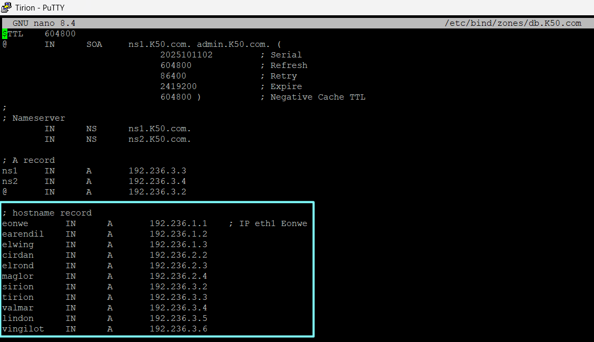

Jangan lupa save dan setelah itu reload server dengan ``rndc reload``
Selanjutnya kita test beberapa domain:
- **vingilot.k50.com**
  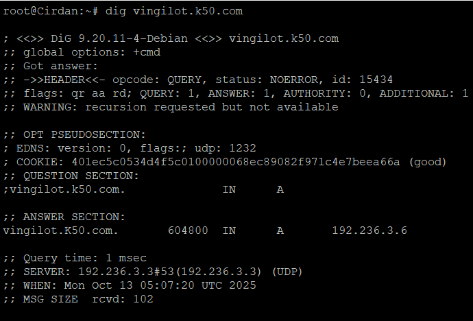
  Terlihat IP Address yang sesuai dengan config kita tadi
- **elwing.k50.com**
  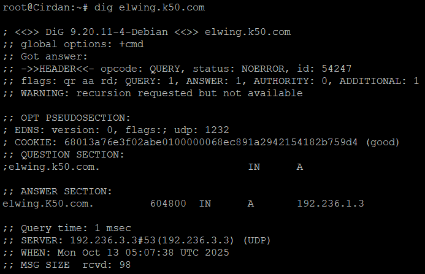
  Terlihat IP Address yang sesuai dengan config kita tadi
- **maglor.k50.com**
  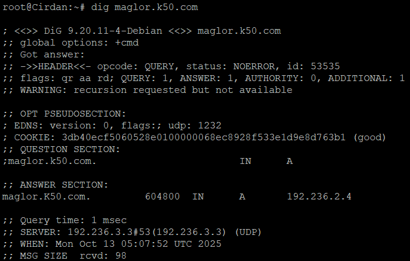
  Terlihat IP Address yang sesuai dengan config kita tadi

## Soal 6
Lonceng Valmar berdentang mengikuti irama Tirion. Pastikan zone transfer berjalan, Pastikan Valmar (ns2) telah menerima salinan zona terbaru dari Tirion (ns1). Nilai serial SOA di keduanya harus sama

Kita lakukan pengecekan apakah nilai serial yang baru di Tirion sama dengan Valmar, kita coba cek dengan:
- Cek Tirion
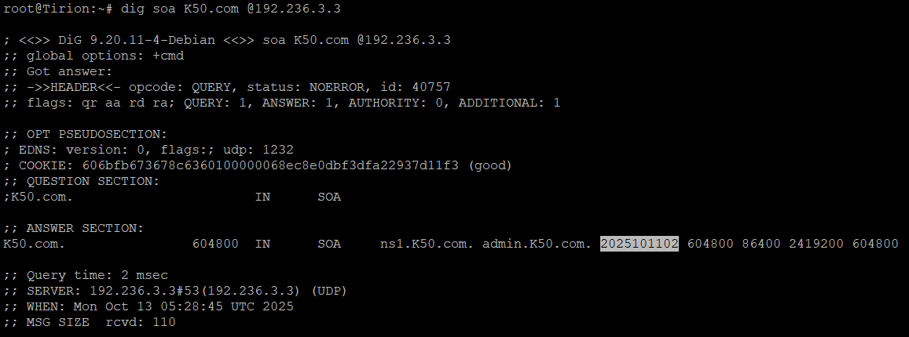
- Cek Valmar
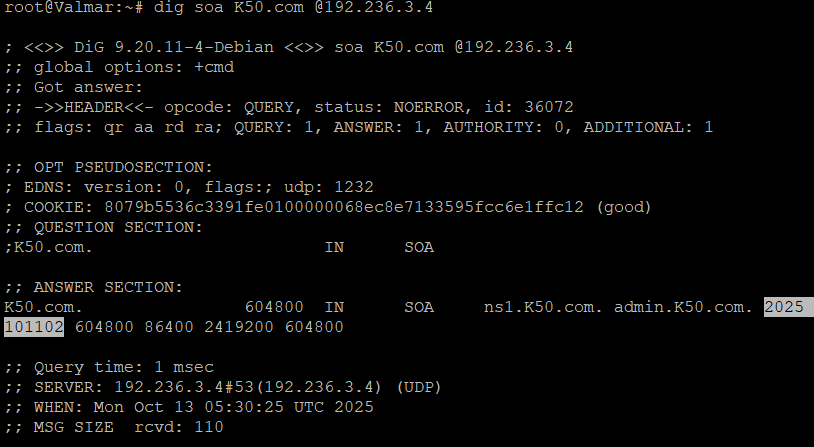

## Soal 7
Tambahkan pada zona <xxxx>.com A record untuk sirion.<xxxx>.com (IP Sirion), lindon.<xxxx>.com (IP Lindon), dan vingilot.<xxxx>.com (IP Vingilot). Tetapkan CNAME :
www.<xxxx>.com → sirion.<xxxx>.com, 
static.<xxxx>.com → lindon.<xxxx>.com, dan 
app.<xxxx>.com → vingilot.<xxxx>.com. 
Verifikasi dari dua klien berbeda bahwa seluruh hostname tersebut ter-resolve ke tujuan yang benar dan konsisten.

Untuk menambahkan cname kita bisa tambahkan di ns1 (**Tirion**) dan membuka ``nano /etc/bind/zones/db.K50.com`` lalu menambahkan:
```/etc/bind/zones/db.K50.com
; Service Aliases (CNAME Records for public-facing names)
www         IN      CNAME   sirion.K50.com.
static      IN      CNAME   lindon.K50.com.
app         IN      CNAME   vingilot.K50.com.
```
Jangan lupa save dan setelah itu reload server dengan ``rndc reload``. Setelah itu kita coba test dengan client **Cirdan** dan **Vingilot**:
- **Cirdan**:
  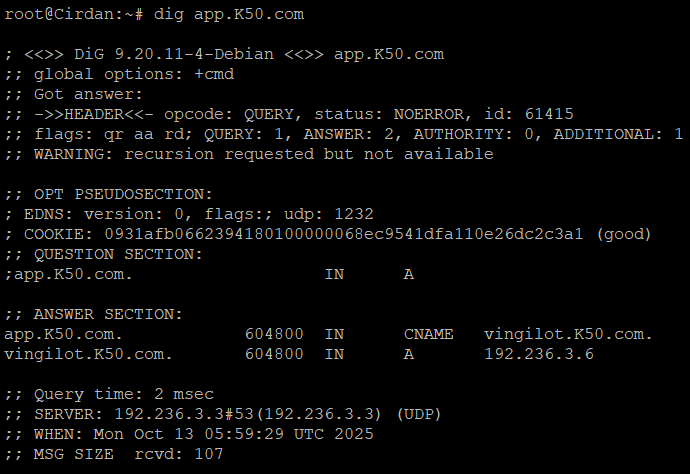
  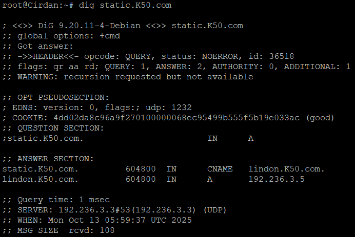
  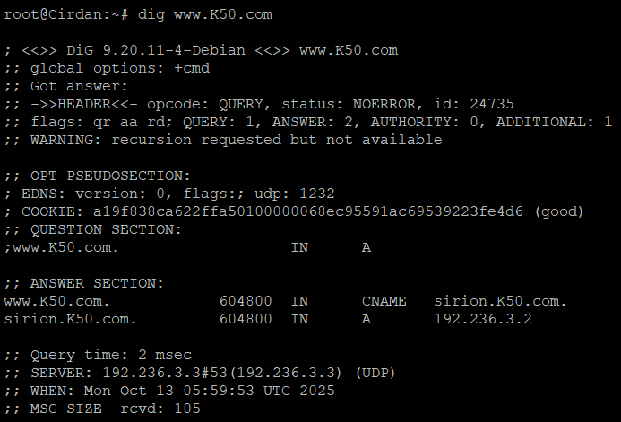
- **Vingilot**:
  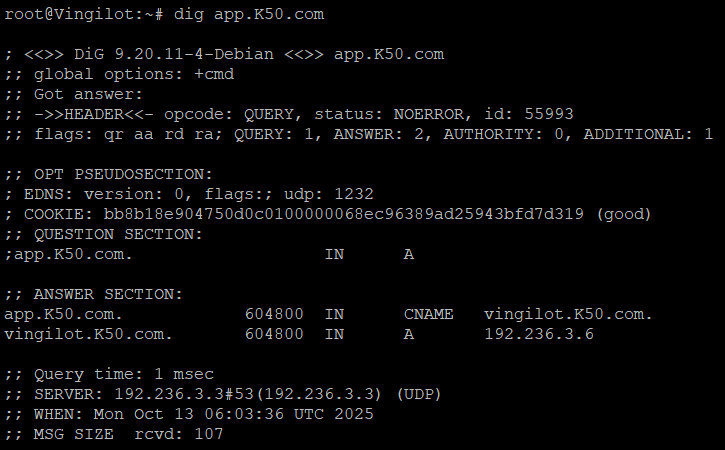
  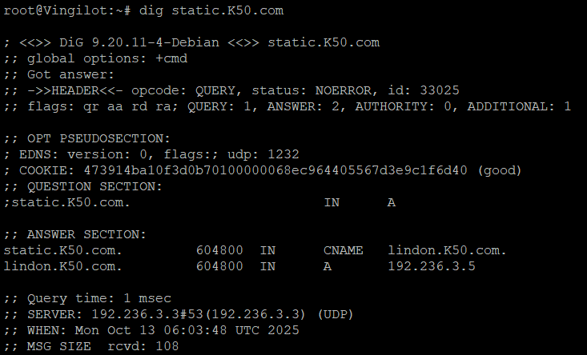
  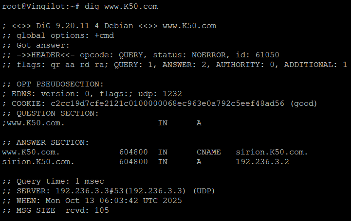
<br>

## Soal 8
Pertama siapkan script sh untuk **Tirion** dan **Valmar**:
- **Tirion**:
```
#!/bin/bash

# --- Configs ---
DOMAIN="K50.com"
REVERSE_ZONE="3.236.192.in-addr.arpa"
REVERSE_ZONE_FILE="/etc/bind/zones/db.192.236.3"
SLAVE_IP="192.236.3.4"

# Deklarasi zone di named.conf.local
tee -a /etc/bind/named.conf.local > /dev/null <<EOF

zone "$REVERSE_ZONE" {
    type master;
    file "$REVERSE_ZONE_FILE";
    allow-transfer { $SLAVE_IP; };
};
EOF

# Buat file reverse zone
tee $REVERSE_ZONE_FILE > /dev/null <<EOF
\$TTL    604800
@       IN      SOA     ns1.$DOMAIN. root.$DOMAIN. (
                        $(date +%Y%m%d)01      ; Serial
                        604800          ; Refresh
                        86400           ; Retry
                        2419200         ; Expire
                        604800 )        ; Negative Cache TTL
;
@       IN      NS      ns1.$DOMAIN.
@       IN      NS      ns2.$DOMAIN.

; PTR Records
2       IN      PTR     sirion.$DOMAIN.
5       IN      PTR     lindon.$DOMAIN.
6       IN      PTR     vingilot.$DOMAIN.
EOF

# Validasi & reload
named-checkconf
named-checkzone $REVERSE_ZONE $REVERSE_ZONE_FILE
rndc reload

echo "Setup reverse master di Tirion selesai."  
```
- **Valmar**:
```
#!/bin/bash

# --- Configs ---
REVERSE_ZONE="3.236.192.in-addr.arpa"
MASTER_IP="192.236.3.3"

# Deklarasi slave zone di named.conf.local
tee -a /etc/bind/named.conf.local > /dev/null <<EOF

zone "$REVERSE_ZONE" {
    type slave;
    file "/var/lib/bind/db.192.236.3";
    masters { $MASTER_IP; };
};
EOF

# Reload
rndc reload

echo "Setup reverse slave di Valmar selesai. Cek syslog buat liat transfer log."
```

Setelah selesai setup reverse proxy, kita lanjutkan uji coba keberhasilan query reverse untuk alamat Sirion, Lindon, Vingilot:
- **Sirion**:
  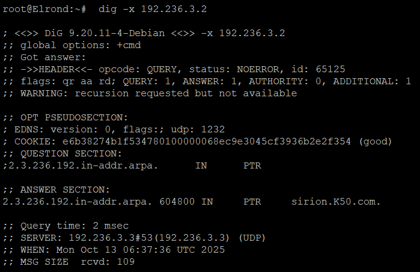
- **Lindon**:
  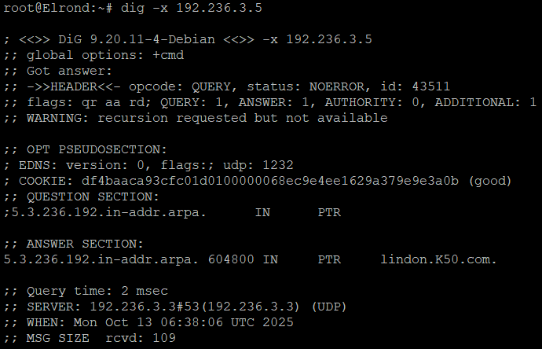
- **Vingilot**:
  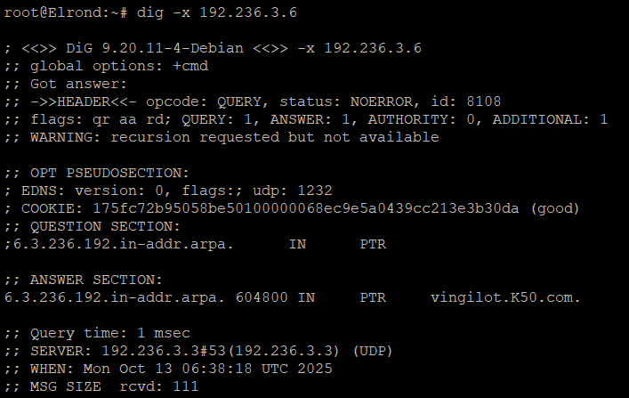

# Soal 9